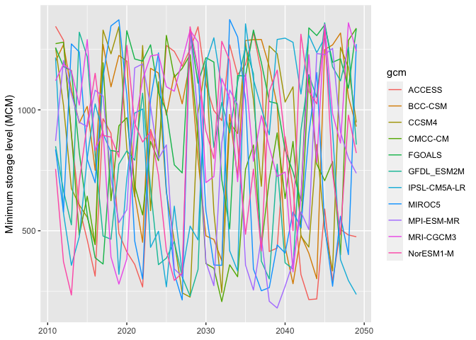

<!-- README.md is generated from README.Rmd. Please edit that file -->

# capratTX

<!-- badges: start -->

[](https://travis-ci.com/pnnl/capratTX)
<!-- badges: end -->

The goal of `capratTX` is to simulate water storage reservoirs providing
cooling water to thermal power plants in the ERCOT.

## Contact

  - Please use [issues](https://github.com/pnnl/capratTX/issues) for Q &
    A.
  - For other information please contact Sean Turner
    (<sean.turner@pnnl.gov>)

## Data requirements

You must download the [ERCOT Reservoir Watershed Delineations and Inflow
Scenarios](10.5281/zenodo.4273147) data files to run this software.

## Installation

You can install the development version of `capratTX` using `devtools`:

``` r
library(devtools)
install_github("pnnl/capratTX")
```

## Usage

Start by loading the library and setting the data path:

``` r
library(capratTX)
data_path <- "your_directory/ERCOT Reservoir Watershed Delineations and Inflow Scenarios/"
```

``` r
data_path <- "../../WECC-ERCOT/ERCOT/data/ERCOT Reservoir Watershed Delineations and Inflow Scenarios/"
```

Calibrate reservoirs and save a parameter file (calibration may take a
minute or two reservoir operating functions are optimized):

``` r
calibrate_all_reservoirs(data_path) -> calibrated_parameters
#> Arlington
#> Arrowhead
#> Bardwell
#> Belton
#> Bridgeport
#> Buchanan
#> Canyon
#> Colorado City
#> Eufaula
#> Falcon
#> Graham
#> Granbury
#> Houston
#> Joe Pool
#> Kemp
#> Lavon
#> Limestone
#> Livingston
#> Palo Pinto
#> Pat Mayse
#> Ray Hubbard
#> Ray Roberts
#> Richland-Chambers
#> Texana
#> Texoma
#> Toledo Bend
#> Whitney
#> Coleto Creek
#> Martin
#> Travis
#> Waco
head(calibrated_parameters)
#> # A tibble: 6 x 3
#>   target hedge reservoir 
#>    <dbl> <dbl> <chr>     
#> 1  0.897 1.05  Arlington 
#> 2  0.955 0.447 Arrowhead 
#> 3  0.498 1.05  Bardwell  
#> 4  0.428 0.816 Belton    
#> 5  0.926 0.472 Bridgeport
#> 6  0.901 0.437 Buchanan
readr::write_csv(calibrated_parameters, "params.csv")
#> Registered S3 methods overwritten by 'readr':
#>   method           from 
#>   format.col_spec  vroom
#>   print.col_spec   vroom
#>   print.collector  vroom
#>   print.date_names vroom
#>   print.locale     vroom
#>   str.col_spec     vroom
```

To simulate all dams with the calibrated rules under a given period
(“baseline” or “future”):

``` r
simulate_gcm_inflows_all_dams(data_path, period = "future",
                              params_path = "params.csv") -> sim_data
head(sim_data)
#> # A tibble: 6 x 8
#>   s_sim r_sim reservoir gcm    inflow  year month s_cap
#>   <dbl> <dbl> <chr>     <chr>   <dbl> <dbl> <dbl> <dbl>
#> 1  49.6  1.97 Arlington ACCESS   1.97  2011     1  49.6
#> 2  49.6  2.04 Arlington ACCESS   2.04  2011     2  49.6
#> 3  49.6  5.80 Arlington ACCESS   5.80  2011     3  49.6
#> 4  49.6  4.08 Arlington ACCESS   4.08  2011     4  49.6
#> 5  49.6  4.71 Arlington ACCESS   4.71  2011     5  49.6
#> 6  49.6  2.23 Arlington ACCESS   2.23  2011     6  49.6
```

Plot storage projections for a particular reservoir:

``` r
library(ggplot2)
library(dplyr)
#> 
#> Attaching package: 'dplyr'
#> The following objects are masked from 'package:stats':
#> 
#>     filter, lag
#> The following objects are masked from 'package:base':
#> 
#>     intersect, setdiff, setequal, union

sim_data %>% 
  # select reservoir desired
  filter(reservoir == "Travis") %>% 
  # get annual minimums
  group_by(reservoir, gcm, year) %>% 
  summarise(s_min = min(s_sim)) %>% 
  ungroup() %>% 
  ggplot(aes(year, s_min, col = gcm)) +
  geom_line() +
  labs(y = "Minimum storage level (MCM)", x = NULL)
```


